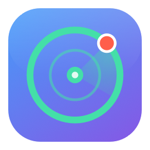

# NoPeek 👁️

<p></p>

macOS 菜单栏应用：**当有人在你身后窥屏时，立刻提醒你**（并可选自动遮挡整个屏幕）。

纯 Swift 原生实现（AVFoundation + Vision），零第三方依赖，**全部画面只在本机实时分析，绝不存储、上传或联网**。不需要安装 Xcode —— 只需 Command Line Tools。

## 功能

- **实时检测**：内置摄像头 @720p，Vision 人脸检测走神经网络引擎，约 10 fps 分析，CPU 占用极低
- **机主识别（V2）**：设置页录入你的脸（Vision 特征印迹，8 个样本，Keychain 加密存储）——之后只对陌生人报警；机主不在场 + 陌生人出现 → 立即报警。身份判定带迟滞缓冲带，你自己的脸在阈值附近抖动不会误报
- **离开保护**：人一走就模糊屏幕 —— 机主消失超过 N 秒（3–30s 可调），隐私盾自动升起；回来立即解除
- **智能判定**：闯入者需同时满足 —— 足够近（能看清屏幕）、**头朝向屏幕**（yaw/pitch 姿态角）、非静止海报脸（微动检测）
- **四种告警**（各自独立开关）：
  - 🔴 视觉警报 —— 菜单栏图标变红 + 脉冲闪烁
  - 🪟 全屏隐私盾 —— 毛玻璃瞬间盖住所有屏幕（点击穿透，不锁键盘），人走自动恢复
  - 🔊 提示音
  - 🔔 系统通知
- **悬浮小窗**：圆角芯片，颜色即状态（绿/黄/红脉冲/灰）；可拖动、贴边自动收成可见标签、悬停展开、右键固定；单击展开实时预览卡片
- **全局快捷键**（无需切到 App）：
  - `⌥⌘B` 手动模糊屏幕开关 —— 隐私盾盖住菜单栏时的**逃逸舱门**
  - `⌥⌘P` 暂停 / 恢复监控
- **诚实隐私**：摄像头指示灯亮 = 正在监控；锁屏/合盖自动停采，回来自动恢复

## 构建与运行

```bash
make cert   # 一次性：生成自签名证书（让摄像头授权在重编译后保持有效）
make run    # 编译 + 打包 + 签名 + 启动
make log    # 实时日志（人脸数/姿态/状态机迁移）
make test   # NoPeekCore 纯逻辑单测（55 项断言）
make reset-permissions  # 重置摄像头/通知授权，重测首次流程
make clean
```

> 为什么需要 `make cert`：macOS TCC 把权限绑定到代码签名身份。ad-hoc 签名每次编译 cdhash 都会变 → 摄像头权限每次重弹。自签名证书固定了身份，授权一次终身有效。证书只在你的本机钥匙串，永不提交进 git。

## 检测算法

```
摄像头 720p 帧 → 节流 10fps → Vision 三级分析（每帧）：
  1. VNDetectFaceRectanglesRequest rev3     找出所有人脸（丢弃过小噪点框）
  2. VNDetectFaceLandmarksRequest rev3      级联填充 yaw/pitch/roll 头部姿态
  3. VNDetectFaceCaptureQualityRequest      质量分（过滤模糊/反光假脸）
  4. VNGenerateImageFeaturePrintRequest     （已录入机主时）每脸身份距离 d
           ↓
  FaceTracker：IoU>0.3 跨帧跟踪 → 稳定 trackID；4 秒零微动 → 标记"海报脸"
           ↓
  身份平滑（V2）：每轨道 EMA 平滑 d（0.55·旧+0.45·新）；转头>30°或低质量时
     冻结读数；机主/陌生人判定带 ±0.10 迟滞缓冲带 —— d 在阈值附近徘徊不会翻转
           ↓
  IntruderAssessor（纯函数）：
     V2：有判定为机主的脸 → 它是机主；其余脸（含"机主不在场"时的所有脸）过门
     V1：最大脸 = 机主；其余脸过 5 道门：
     距离 ≥ 0.004 归一化面积(≈2.5m) ｜ |yaw|≤35° 且 |pitch|≤30° ｜ 质量≥0.10
     ｜ 非静止海报脸 ｜ 姿态缺失默认算"面向"（宁多报勿漏报，可开严格模式）
           ↓
  DetectionStateMachine（迟滞防抖）：
     监控 →(连续3帧闯入, ~0.3s)→ 报警 →(连续12帧干净, ~1.2s)→ 冷却(4s) → 监控
     冷却期内 2 帧闯入 → 立即重新报警
```

误报对策：海报/照片（微动抑制）、远处路人（距离门）、路过不看屏幕（朝向门）、单帧抖动（迟滞）、机主本人姿态/光线漂移（身份缓冲带）。已知局限：电视里会动的陌生人脸仍可能触发（此时它确实"在看你屏幕"——语义上不算冤枉）。

**机主识别细节**：录入是 Face ID 式引导——脸对准椭圆框并保持 0.8 秒即**自动开始**，缓慢转头一圈点亮 8 个姿态扇区（每扇区 1 个样本）+ 正对 3 个样本，共 11 个特征印迹，覆盖运行时实际匹配的 ±30° 姿态范围。样本经 NSSecureCoding 归档存 Keychain（ThisDeviceOnly），匹配走 `computeDistance` 取最近样本距离。调参：打开调试浮层（菜单栏 → 调试浮层）看自己脸上的 `d=` 实时值与 OWNER/STRANGER 标签，再把"识别严格度"滑块调到「自己 d 值 + 0.15」左右。

## 隐私设计

- 像素缓冲只在内存中同步消费，**从不写盘、从不保留**
- 摄像头预览画面只在你主动点开悬浮窗时显示
- 隐私盾启动时悬浮窗被盖在盾下（层级设计）——窥屏者看不到预览
- 无网络请求、无沙盒外访问、无埋点

## 项目结构

```
Makefile                   # 无 Xcode 构建：swiftc 单模块编译 + .app 组装 + 签名
Resources/Info.plist       # LSUIElement + NSCameraUsageDescription（bundle ID 勿改）
Sources/
  NoPeekCore/              # 纯逻辑（可单测）：检测类型、五门判定、状态机、人脸跟踪
  NoPeek/                  # App 壳：摄像头管线、Vision 分析、告警、菜单栏、悬浮窗、设置
Tests/NoPeekCoreTests/     # 断言式测试运行器（CLT 无 XCTest，swiftc 直编）
```

## 路线图

- 机主样本在线自适应：光线/外观随天变化时自动补充高置信度样本，减少重新录入
- 可选替换 MobileFaceNet 类专用嵌入模型（`OwnerMatcher` 类边界已隔离，换实现不动管线）

## 故障排查

| 症状 | 处理 |
|---|---|
| 摄像头权限反复弹 | 没跑 `make cert`；或改了 bundle ID（勿改） |
| 快捷键无响应 | 与其他 App 的 ⌥⌘B/⌥⌘P 冲突；`make log` 里会有注册失败警告 |
| 误报（电视/海报） | 设置里开"抑制静止人脸"、调近检测距离、或开严格朝向模式 |
| 机主自己被误报 | 开调试浮层看自己脸上的 d= 值，把"识别严格度"滑块调高；或换个光线重新录入 |
| 想彻底重来 | `make reset-permissions` + 删除应用 |

---

*License: 仅供个人使用。*
